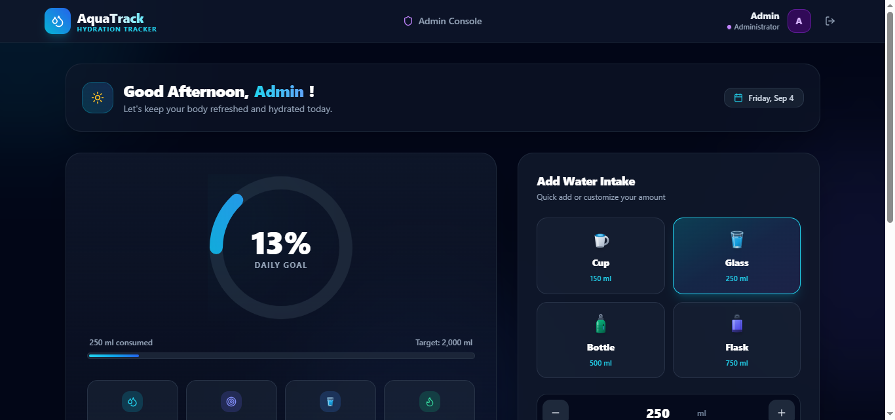
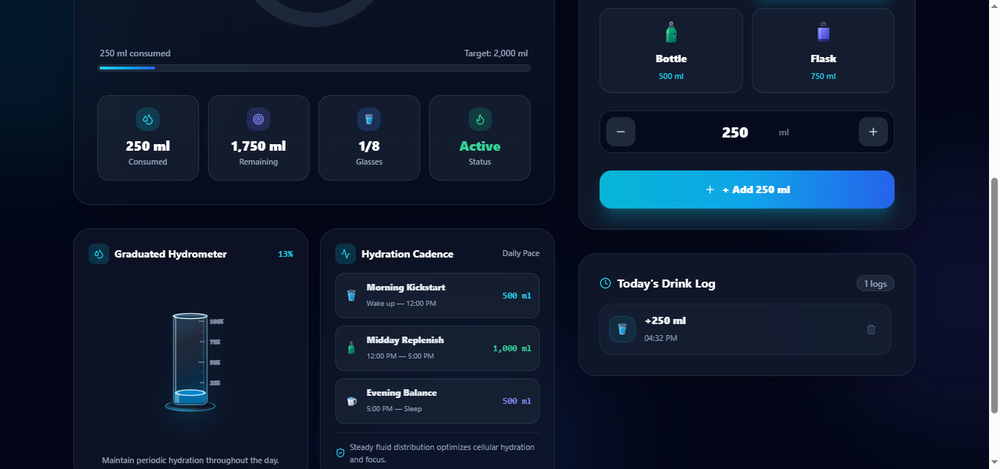
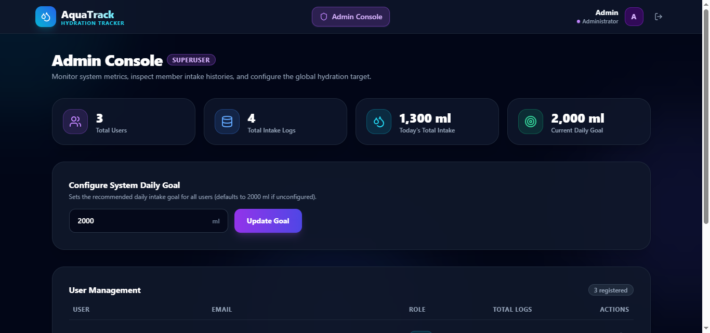
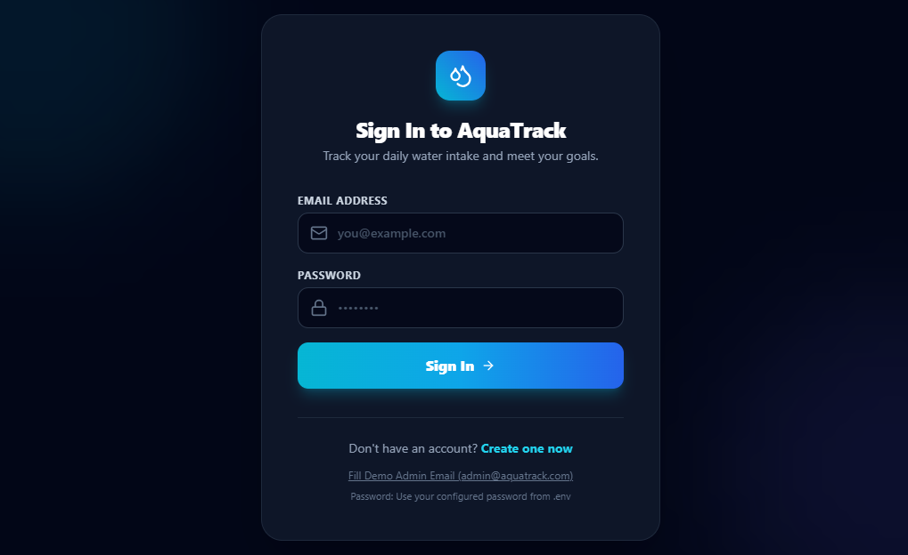

# AquaTrack — Frontend Web Application

Modern, high-performance web application for **AquaTrack** — an intuitive daily water intake tracker engineered with an atmospheric dark glassmorphic UI, realistic physical vector components, real-time hydration telemetry, comprehensive historical analytics, and administrative oversight.

Developed for the **Kravix Tech Fullstack Internship Assignment**.

---

## Visual Showcase & UI Highlights

### 1. Hydration Dashboard & Realistic Container Presets

*Dark atmospheric dashboard featuring an animated circular progress ring, real-time hydration KPI cards, and custom realistic physical objects (Ceramic Cup, Crystal Glass Tumbler, Stainless Steel Sport Bottle, and Insulated Hydro Flask) with custom volume steppers.*

### 2. Graduated Hydrometer & Daily Hydration Cadence

*Laboratory-grade borosilicate graduated cylinder showing live fluid meniscus and wave animations, scientific daily hydration schedule (Morning, Midday, Evening targets), and timestamped drink activity log.*

### 3. Superuser Admin Console

*Centralized administration portal displaying system-wide aggregate KPIs (Users, Logs, Daily Total, Active Target), global daily goal configuration, and user table with cascade warning modals and log inspection.*

### 4. Dark Glassmorphic Authentication

*Secure authentication with ambient radial glow orbs, frosted glass borders, responsive validation states, and secure demo email autofill.*

---

## Table of Contents
- [Overview](#overview)
- [Key Features](#key-features)
- [Tech Stack](#tech-stack)
- [Application Architecture](#application-architecture)
- [Automated Testing Suite](#automated-testing-suite)
- [Continuous Integration (CI)](#continuous-integration-ci)
- [Getting Started](#getting-started)
- [Environment Configuration](#environment-configuration)
- [Routes & Role-Based Guarding](#routes--role-based-guarding)
- [Verification & Production Build](#verification--production-build)

---

## Overview

AquaTrack delivers a refined, mobile-responsive user experience across two distinct user roles:

1. **User Experience**:
   - **Circular SVG Progress Ring**: Visual daily percentage tracker with smooth SVG stroke animations.
   - **Realistic Physical Objects**: Custom vector models for Cup (150 ml), Glass (250 ml), Bottle (500 ml), and Flask (750 ml) replacing cartoon stickers.
   - **Graduated Hydrometer**: Volumetric borosilicate cylinder reflecting exact daily fluid intake.
   - **Intake Schedule**: Daily pace targets (Morning Kickstart 500 ml, Midday Replenish 1,000 ml, Evening Balance 500 ml).
   - **Drink Activity Log**: Timestamped logs with beverage-specific realistic icons and one-click removal.
   - **Historical Tracking**: Grouped calendar view with UTC day consistency and goal badges.

2. **Admin Experience**:
   - **Real-Time Telemetry**: Total users, total intake logs, system-wide today intake volume, and active target.
   - **User Table**: Comprehensive member listing with inspection modals.
   - **Cascade User Deletion**: Safe deletion modal with cascade warnings and admin self-delete protection.
   - **Global Goal Management**: Instant system-wide recommendation updates.

---

## Key Features

- **Dark Glassmorphic UI**: High-fidelity dark aesthetic (`bg-slate-950`, ambient radial cyan/blue glows, backdrop blur, frosted borders).
- **Zero-Sticker Design**: Realistic physical glassware and container vectors built using clean inline SVGs with accurate lighting and reflections.
- **Defensive Error Handling**: Safe `localStorage` JSON parsing with fallback error recovery; non-intrusive toast notifications.
- **Guaranteed Fallback**: Defensive default target of `2000 ml` if backend settings are uninitialized.
- **Axios Interceptor Pipeline**: Automatic Bearer token injection and seamless handling of expired sessions.

---

## Tech Stack

- **Framework**: React 18 + Vite
- **Language**: TypeScript (strict compiler configuration)
- **Styling**: Tailwind CSS, PostCSS, Autoprefixer
- **Icons**: Lucide React
- **Routing**: React Router v6
- **HTTP Client**: Axios with request/response interceptors
- **Testing**: Vitest, React Testing Library, jsdom, @testing-library/jest-dom
- **CI/CD**: GitHub Actions workflow (`.github/workflows/ci.yml`)

---

## Application Architecture

```
aquatrack-frontend/
├── .github/
│   └── workflows/
│       └── ci.yml             # Automated CI pipeline running across Node 18 & 20
├── docs/
│   └── screenshots/           # High-resolution UI showcase images
├── src/
│   ├── __tests__/             # Automated Vitest component & integration test suites
│   │   ├── setup.ts           # Test environment setup with jest-dom matchers
│   │   ├── AuthContext.test.tsx    # Token restoration, corrupted storage handling
│   │   ├── ProtectedRoute.test.tsx # Route guarding and admin RBAC restriction
│   │   └── Dashboard.test.tsx      # Metrics rendering, preset selection, intake logging
│   ├── api/
│   │   ├── client.ts          # Axios instance with auth headers & error interceptors
│   │   ├── authApi.ts         # Register, Login, GetMe session restore
│   │   ├── intakeApi.ts       # Log intake, Today summary, History, Delete entry
│   │   ├── adminApi.ts        # Admin metrics, user inspection, cascade delete
│   │   └── settingsApi.ts     # Global daily goal get & update
│   ├── components/
│   │   ├── common/
│   │   │   ├── ProtectedRoute.tsx  # Role-aware route guard
│   │   │   ├── Modal.tsx           # Accessible modal dialog
│   │   │   └── RealisticObjects.tsx # Realistic Cup, Glass, Bottle, Flask, Cylinder SVGs
│   │   └── layout/
│   │       ├── Navbar.tsx          # Glassmorphic navbar with role badge & navigation
│   │       └── Layout.tsx          # Outer app shell with ambient background glow
│   ├── context/
│   │   ├── AuthContext.tsx         # Persistent JWT session, login, register, logout
│   │   └── ToastContext.tsx        # Toast alert system
│   ├── pages/
│   │   ├── auth/
│   │   │   ├── Login.tsx           # Glassmorphic login with demo email pre-fill
│   │   │   └── Register.tsx        # Account registration with client-side validation
│   │   ├── user/
│   │   │   ├── Dashboard.tsx       # Live progress, presets, hydrometer, cadence, log
│   │   │   └── History.tsx         # Calendar-grouped history with stats
│   │   └── admin/
│   │       └── Dashboard.tsx       # Metrics, user table, goal config, delete modal
│   ├── types/
│   │   └── index.ts                # TypeScript data models and API response types
│   ├── App.tsx                     # Route hierarchy
│   ├── index.css                   # Custom wave animations and Tailwind directives
│   └── main.tsx                    # React root bootstrap
├── .env.example                    # Environment template
├── package.json                    # Scripts and dependencies
├── tailwind.config.js              # Tailwind configuration
├── tsconfig.json                   # TypeScript configuration
└── vite.config.ts                  # Vite & Vitest configuration
```

---

## Automated Testing Suite

The frontend includes a test suite covering authentication resilience, route authorization, and interactive hydration logging:

- **AuthContext Tests**:
  - Unauthenticated initialization on empty storage
  - Session restoration from valid tokens via `getMeApi`
  - Safe parsing of corrupted `localStorage` JSON without crashing
  - Login state updates and logout cleanup
- **ProtectedRoute Tests**:
  - Redirects unauthenticated visitors to `/login`
  - Permits authenticated users into protected views
  - Blocks standard users from accessing `/admin`
  - Grants access to users with `admin` role
- **Dashboard Tests**:
  - Renders today's summary metrics and realistic presets
  - Container preset clicks update the selected volume
  - Intake logging dispatches API call and updates summary
  - API errors trigger user-friendly toast alerts

Run tests:
```bash
npm test
```

Run full verification (linting, automated tests, and production build):
```bash
npm run verify
```

---

## Continuous Integration (CI)

A GitHub Actions workflow is configured in `.github/workflows/ci.yml`. On every push and pull request to `main`, the workflow executes:
- Multi-version matrix test across **Node.js 18.x and 20.x**
- Clean dependency installation via `npm ci`
- Full verification command: `npm run verify` (`tsc --noEmit && npm run test && npm run build`)

---

## Getting Started

### Prerequisites
- Node.js (v18 or higher)
- npm (v9 or higher)
- Running instance of `aquatrack-backend` (port 5000)

### Installation
1. Clone the repository and navigate into the directory:
   ```bash
   git clone https://github.com/Chandradeep05/aquatrack-frontend.git
   cd aquatrack-frontend
   ```

2. Install dependencies:
   ```bash
   npm install
   ```

3. Configure environment variables:
   ```bash
   cp .env.example .env
   ```
   *Default: `VITE_API_URL=http://localhost:5000/api`*

4. Launch development server:
   ```bash
   npm run dev
   ```

The application will be accessible at `http://localhost:5173`.

---

## Routes & Role-Based Guarding

| Route | Protection | Allowed Roles | Description |
|---|---|---|---|
| `/login` | Public | All | Sign in with email and password |
| `/register` | Public | All | Register a new user account |
| `/` | Authenticated | `user`, `admin` | User dashboard with hydration tracking |
| `/history` | Authenticated | `user`, `admin` | Calendar-grouped consumption history |
| `/admin` | Admin Only | `admin` | Platform metrics, user table, goal configuration |
| `*` | Catch-all | All | Redirects to `/` |

---

## Verification & Production Build

Execute the complete verification pipeline:
```bash
npm run verify
```

This compiles TypeScript, executes all Vitest suites, and bundles optimized static assets into `/dist`.
